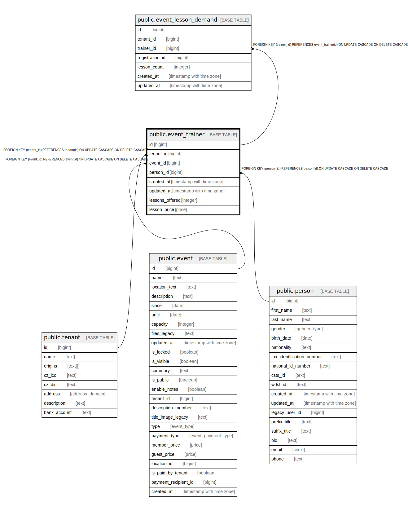

# public.event_trainer

## Description

@omit create,update,delete  
@simpleCollections only

## Columns

| Name | Type | Default | Nullable | Children | Parents | Comment |
| ---- | ---- | ------- | -------- | -------- | ------- | ------- |
| id | bigint |  | false | [public.event_lesson_demand](public.event_lesson_demand.md) |  |  |
| tenant_id | bigint | current_tenant_id() | false |  | [public.tenant](public.tenant.md) |  |
| event_id | bigint |  | false |  | [public.event](public.event.md) |  |
| person_id | bigint |  | false |  | [public.person](public.person.md) |  |
| created_at | timestamp with time zone | now() | false |  |  |  |
| updated_at | timestamp with time zone | now() | false |  |  |  |
| lessons_offered | integer | 0 | false |  |  |  |
| lesson_price | price | NULL::price_type | true |  |  |  |

## Constraints

| Name | Type | Definition |
| ---- | ---- | ---------- |
| event_trainer_pkey | PRIMARY KEY | PRIMARY KEY (id) |
| event_trainer_trainer_id_key | UNIQUE | UNIQUE (event_id, person_id) |
| event_trainer_event_id_fkey | FOREIGN KEY | FOREIGN KEY (event_id) REFERENCES event(id) ON UPDATE CASCADE ON DELETE CASCADE |
| event_trainer_person_id_fkey | FOREIGN KEY | FOREIGN KEY (person_id) REFERENCES person(id) ON UPDATE CASCADE ON DELETE CASCADE |
| event_trainer_tenant_id_fkey | FOREIGN KEY | FOREIGN KEY (tenant_id) REFERENCES tenant(id) ON UPDATE CASCADE ON DELETE CASCADE |

## Indexes

| Name | Definition |
| ---- | ---------- |
| event_trainer_pkey | CREATE UNIQUE INDEX event_trainer_pkey ON public.event_trainer USING btree (id) |
| event_trainer_trainer_id_key | CREATE UNIQUE INDEX event_trainer_trainer_id_key ON public.event_trainer USING btree (event_id, person_id) |
| event_trainer_event_id_idx | CREATE INDEX event_trainer_event_id_idx ON public.event_trainer USING btree (event_id) |
| event_trainer_person_id_idx | CREATE INDEX event_trainer_person_id_idx ON public.event_trainer USING btree (person_id) |
| event_trainer_event_idx | CREATE INDEX event_trainer_event_idx ON public.event_trainer USING btree (event_id, person_id) |
| event_trainer_tenant_event_idx | CREATE INDEX event_trainer_tenant_event_idx ON public.event_trainer USING btree (tenant_id, event_id) |

## Triggers

| Name | Definition |
| ---- | ---------- |
| _100_timestamps | CREATE TRIGGER _100_timestamps BEFORE INSERT OR UPDATE ON public.event_trainer FOR EACH ROW EXECUTE FUNCTION app_private.tg__timestamps() |

## Relations

---

> Generated by [tbls](https://github.com/k1LoW/tbls)
