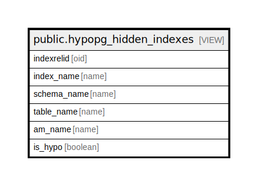

# public.hypopg_hidden_indexes

## Description

<details>
<summary><strong>Table Definition</strong></summary>

```sql
CREATE VIEW hypopg_hidden_indexes AS (
 SELECT h.indexid AS indexrelid,
    i.relname AS index_name,
    n.nspname AS schema_name,
    t.relname AS table_name,
    m.amname AS am_name,
    false AS is_hypo
   FROM (((((hypopg_hidden_indexes() h(indexid)
     JOIN pg_index x ON ((x.indexrelid = h.indexid)))
     JOIN pg_class i ON ((i.oid = h.indexid)))
     JOIN pg_namespace n ON ((n.oid = i.relnamespace)))
     JOIN pg_class t ON ((t.oid = x.indrelid)))
     JOIN pg_am m ON ((m.oid = i.relam)))
UNION ALL
 SELECT hl.indexrelid,
    hl.index_name,
    hl.schema_name,
    hl.table_name,
    hl.am_name,
    true AS is_hypo
   FROM (hypopg_hidden_indexes() hi(indexid)
     JOIN hypopg_list_indexes hl ON ((hl.indexrelid = hi.indexid)))
  ORDER BY 2
)
```

</details>

## Columns

| Name | Type | Default | Nullable | Children | Parents | Comment |
| ---- | ---- | ------- | -------- | -------- | ------- | ------- |
| indexrelid | oid |  | true |  |  |  |
| index_name | name |  | true |  |  |  |
| schema_name | name |  | true |  |  |  |
| table_name | name |  | true |  |  |  |
| am_name | name |  | true |  |  |  |
| is_hypo | boolean |  | true |  |  |  |

## Referenced Tables

| Name | Columns | Comment | Type |
| ---- | ------- | ------- | ---- |
| [public.hypopg_hidden_indexes](public.hypopg_hidden_indexes.md) | 6 |  | VIEW |
| [pg_index](pg_index.md) | 0 |  |  |
| [pg_class](pg_class.md) | 0 |  |  |
| [pg_namespace](pg_namespace.md) | 0 |  |  |
| [pg_am](pg_am.md) | 0 |  |  |
| [public.hypopg_list_indexes](public.hypopg_list_indexes.md) | 5 |  | VIEW |

## Relations



---

> Generated by [tbls](https://github.com/k1LoW/tbls)
