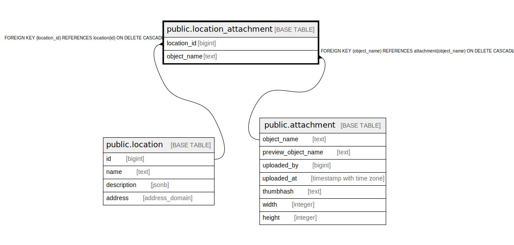

# public.location_attachment

## Description

@omit create,update,delete

## Columns

| Name | Type | Default | Nullable | Children | Parents | Comment |
| ---- | ---- | ------- | -------- | -------- | ------- | ------- |
| location_id | bigint |  | false |  | [public.location](public.location.md) |  |
| object_name | text |  | false |  | [public.attachment](public.attachment.md) |  |

## Constraints

| Name | Type | Definition |
| ---- | ---- | ---------- |
| location_attachment_object_name_fkey | FOREIGN KEY | FOREIGN KEY (object_name) REFERENCES attachment(object_name) ON DELETE CASCADE |
| location_attachment_pkey | PRIMARY KEY | PRIMARY KEY (location_id, object_name) |
| location_attachment_location_id_fkey | FOREIGN KEY | FOREIGN KEY (location_id) REFERENCES location(id) ON DELETE CASCADE |

## Indexes

| Name | Definition |
| ---- | ---------- |
| location_attachment_pkey | CREATE UNIQUE INDEX location_attachment_pkey ON public.location_attachment USING btree (location_id, object_name) |
| object_name | CREATE INDEX object_name ON public.location_attachment USING btree (object_name) |

## Relations

---

> Generated by [tbls](https://github.com/k1LoW/tbls)
