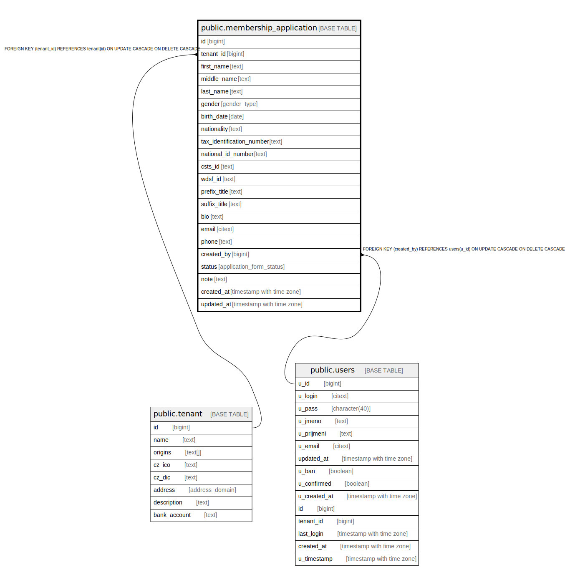

# public.membership_application

## Description

@simpleCollections only

## Columns

| Name | Type | Default | Nullable | Children | Parents | Comment |
| ---- | ---- | ------- | -------- | -------- | ------- | ------- |
| id | bigint |  | false |  |  |  |
| tenant_id | bigint | current_tenant_id() | false |  | [public.tenant](public.tenant.md) |  |
| first_name | text |  | false |  |  |  |
| middle_name | text |  | true |  |  |  |
| last_name | text |  | false |  |  |  |
| gender | gender_type |  | false |  |  |  |
| birth_date | date |  | true |  |  |  |
| nationality | text |  | false |  |  |  |
| tax_identification_number | text |  | true |  |  |  |
| national_id_number | text |  | true |  |  |  |
| csts_id | text |  | true |  |  |  |
| wdsf_id | text |  | true |  |  |  |
| prefix_title | text |  | true |  |  |  |
| suffix_title | text |  | true |  |  |  |
| bio | text |  | true |  |  |  |
| email | citext |  | true |  |  |  |
| phone | text |  | true |  |  |  |
| created_by | bigint |  | false |  | [public.users](public.users.md) |  |
| status | application_form_status | 'sent'::application_form_status | false |  |  |  |
| note | text | ''::text | false |  |  |  |
| created_at | timestamp with time zone | now() | false |  |  |  |
| updated_at | timestamp with time zone | now() | false |  |  |  |

## Constraints

| Name | Type | Definition |
| ---- | ---- | ---------- |
| membership_application_created_by_fkey | FOREIGN KEY | FOREIGN KEY (created_by) REFERENCES users(u_id) ON UPDATE CASCADE ON DELETE CASCADE |
| membership_application_pkey | PRIMARY KEY | PRIMARY KEY (id) |
| membership_application_tenant_id_fkey | FOREIGN KEY | FOREIGN KEY (tenant_id) REFERENCES tenant(id) ON UPDATE CASCADE ON DELETE CASCADE |

## Indexes

| Name | Definition |
| ---- | ---------- |
| membership_application_pkey | CREATE UNIQUE INDEX membership_application_pkey ON public.membership_application USING btree (id) |

## Triggers

| Name | Definition |
| ---- | ---------- |
| _100_timestamps | CREATE TRIGGER _100_timestamps BEFORE INSERT OR UPDATE ON public.membership_application FOR EACH ROW EXECUTE FUNCTION app_private.tg__timestamps() |

## Relations

---

> Generated by [tbls](https://github.com/k1LoW/tbls)
