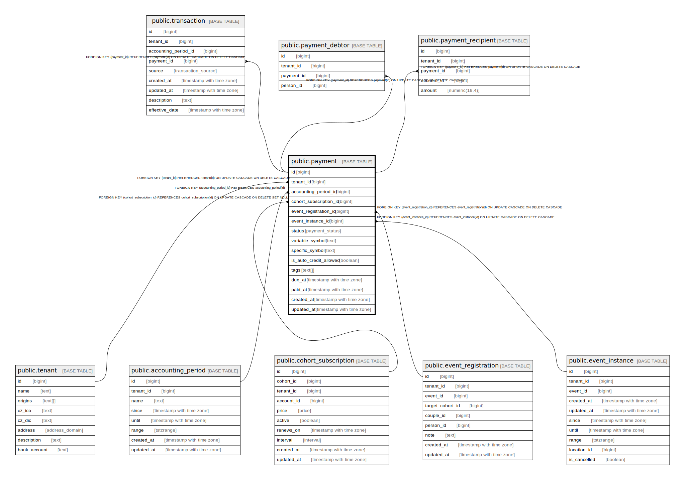

# public.payment

## Description

@omit create  
@simpleCollections only

## Columns

| Name | Type | Default | Nullable | Children | Parents | Comment |
| ---- | ---- | ------- | -------- | -------- | ------- | ------- |
| id | bigint |  | false | [public.transaction](public.transaction.md) [public.payment_debtor](public.payment_debtor.md) [public.payment_recipient](public.payment_recipient.md) |  |  |
| tenant_id | bigint | current_tenant_id() | false |  | [public.tenant](public.tenant.md) |  |
| accounting_period_id | bigint |  | false |  | [public.accounting_period](public.accounting_period.md) |  |
| cohort_subscription_id | bigint |  | true |  | [public.cohort_subscription](public.cohort_subscription.md) |  |
| event_registration_id | bigint |  | true |  | [public.event_registration](public.event_registration.md) |  |
| event_instance_id | bigint |  | true |  | [public.event_instance](public.event_instance.md) |  |
| status | payment_status |  | false |  |  |  |
| variable_symbol | text |  | true |  |  |  |
| specific_symbol | text |  | true |  |  |  |
| is_auto_credit_allowed | boolean | true | false |  |  |  |
| tags | text[] | ARRAY[]::text[] | false |  |  |  |
| due_at | timestamp with time zone |  | true |  |  |  |
| paid_at | timestamp with time zone |  | true |  |  |  |
| created_at | timestamp with time zone | now() | false |  |  |  |
| updated_at | timestamp with time zone | now() | false |  |  |  |

## Constraints

| Name | Type | Definition |
| ---- | ---- | ---------- |
| payment_accounting_period_id_fkey | FOREIGN KEY | FOREIGN KEY (accounting_period_id) REFERENCES accounting_period(id) |
| payment_cohort_subscription_id_fkey | FOREIGN KEY | FOREIGN KEY (cohort_subscription_id) REFERENCES cohort_subscription(id) ON UPDATE CASCADE ON DELETE SET NULL |
| payment_event_instance_id_fkey | FOREIGN KEY | FOREIGN KEY (event_instance_id) REFERENCES event_instance(id) ON UPDATE CASCADE ON DELETE CASCADE |
| payment_event_registration_id_fkey | FOREIGN KEY | FOREIGN KEY (event_registration_id) REFERENCES event_registration(id) ON UPDATE CASCADE ON DELETE CASCADE |
| payment_pkey | PRIMARY KEY | PRIMARY KEY (id) |
| payment_tenant_id_fkey | FOREIGN KEY | FOREIGN KEY (tenant_id) REFERENCES tenant(id) ON UPDATE CASCADE ON DELETE CASCADE |

## Indexes

| Name | Definition |
| ---- | ---------- |
| payment_pkey | CREATE UNIQUE INDEX payment_pkey ON public.payment USING btree (id) |

## Triggers

| Name | Definition |
| ---- | ---------- |
| _100_timestamps | CREATE TRIGGER _100_timestamps BEFORE INSERT OR UPDATE ON public.payment FOR EACH ROW EXECUTE FUNCTION app_private.tg__timestamps() |
| _200_fill_accounting_period | CREATE TRIGGER _200_fill_accounting_period BEFORE INSERT ON public.payment FOR EACH ROW EXECUTE FUNCTION app_private.tg_payment__fill_accounting_period() |

## Relations

---

> Generated by [tbls](https://github.com/k1LoW/tbls)
