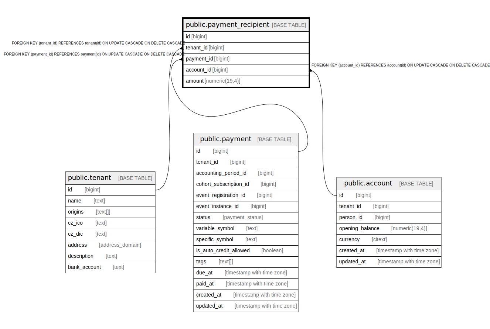

# public.payment_recipient

## Description

@omit create,update,delete  
@simpleCollections only

## Columns

| Name | Type | Default | Nullable | Children | Parents | Comment |
| ---- | ---- | ------- | -------- | -------- | ------- | ------- |
| id | bigint |  | false |  |  |  |
| tenant_id | bigint | current_tenant_id() | false |  | [public.tenant](public.tenant.md) |  |
| payment_id | bigint |  | false |  | [public.payment](public.payment.md) |  |
| account_id | bigint |  | false |  | [public.account](public.account.md) |  |
| amount | numeric(19,4) |  | false |  |  |  |

## Constraints

| Name | Type | Definition |
| ---- | ---- | ---------- |
| payment_recipient_account_id_fkey | FOREIGN KEY | FOREIGN KEY (account_id) REFERENCES account(id) ON UPDATE CASCADE ON DELETE CASCADE |
| payment_recipient_payment_id_fkey | FOREIGN KEY | FOREIGN KEY (payment_id) REFERENCES payment(id) ON UPDATE CASCADE ON DELETE CASCADE |
| payment_recipient_pkey | PRIMARY KEY | PRIMARY KEY (id) |
| payment_recipient_tenant_id_fkey | FOREIGN KEY | FOREIGN KEY (tenant_id) REFERENCES tenant(id) ON UPDATE CASCADE ON DELETE CASCADE |

## Indexes

| Name | Definition |
| ---- | ---------- |
| payment_recipient_pkey | CREATE UNIQUE INDEX payment_recipient_pkey ON public.payment_recipient USING btree (id) |

## Relations

---

> Generated by [tbls](https://github.com/k1LoW/tbls)
