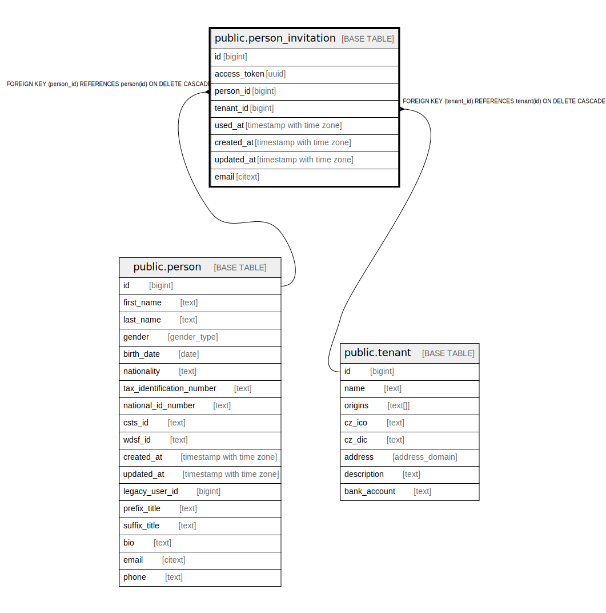

# public.person_invitation

## Description

@omit update  
@simpleCollections only

## Columns

| Name | Type | Default | Nullable | Children | Parents | Comment |
| ---- | ---- | ------- | -------- | -------- | ------- | ------- |
| id | bigint |  | false |  |  |  |
| access_token | uuid | gen_random_uuid() | false |  |  |  |
| person_id | bigint |  | true |  | [public.person](public.person.md) |  |
| tenant_id | bigint | current_tenant_id() | false |  | [public.tenant](public.tenant.md) |  |
| used_at | timestamp with time zone |  | true |  |  |  |
| created_at | timestamp with time zone | now() | false |  |  |  |
| updated_at | timestamp with time zone | now() | false |  |  |  |
| email | citext |  | false |  |  |  |

## Constraints

| Name | Type | Definition |
| ---- | ---- | ---------- |
| person_invitation_access_token_key | UNIQUE | UNIQUE (access_token) |
| person_invitation_pkey | PRIMARY KEY | PRIMARY KEY (id) |
| person_invitation_person_id_fkey | FOREIGN KEY | FOREIGN KEY (person_id) REFERENCES person(id) ON DELETE CASCADE |
| person_invitation_tenant_id_fkey | FOREIGN KEY | FOREIGN KEY (tenant_id) REFERENCES tenant(id) ON DELETE CASCADE |

## Indexes

| Name | Definition |
| ---- | ---------- |
| person_invitation_access_token_key | CREATE UNIQUE INDEX person_invitation_access_token_key ON public.person_invitation USING btree (access_token) |
| person_invitation_pkey | CREATE UNIQUE INDEX person_invitation_pkey ON public.person_invitation USING btree (id) |

## Triggers

| Name | Definition |
| ---- | ---------- |
| _500_send | CREATE TRIGGER _500_send AFTER INSERT ON public.person_invitation FOR EACH ROW EXECUTE FUNCTION app_private.tg_person_invitation__send() |

## Relations

---

> Generated by [tbls](https://github.com/k1LoW/tbls)
