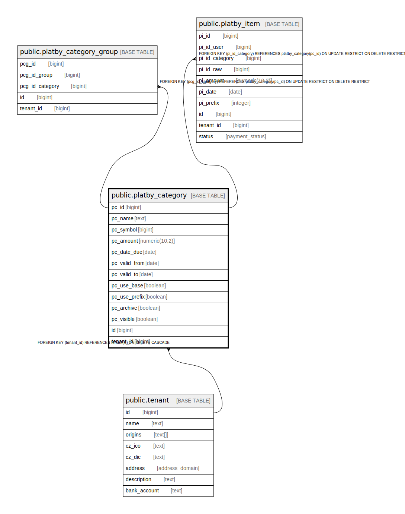

# public.platby_category

## Description

@omit create,update,delete

## Columns

| Name | Type | Default | Nullable | Extra Definition | Children | Parents | Comment |
| ---- | ---- | ------- | -------- | ---------------- | -------- | ------- | ------- |
| pc_id | bigint | nextval('platby_category_pc_id_seq'::regclass) | false |  | [public.platby_category_group](public.platby_category_group.md) [public.platby_item](public.platby_item.md) |  |  |
| pc_name | text |  | false |  |  |  |  |
| pc_symbol | bigint |  | false |  |  |  |  |
| pc_amount | numeric(10,2) |  | false |  |  |  |  |
| pc_date_due | date |  | false |  |  |  |  |
| pc_valid_from | date |  | false |  |  |  |  |
| pc_valid_to | date |  | false |  |  |  |  |
| pc_use_base | boolean | false | false |  |  |  |  |
| pc_use_prefix | boolean | false | false |  |  |  |  |
| pc_archive | boolean | false | false |  |  |  |  |
| pc_visible | boolean | true | false |  |  |  |  |
| id | bigint |  | false | GENERATED ALWAYS AS pc_id STORED |  |  |  |
| tenant_id | bigint | current_tenant_id() | false |  |  | [public.tenant](public.tenant.md) |  |

## Constraints

| Name | Type | Definition |
| ---- | ---- | ---------- |
| idx_24677_primary | PRIMARY KEY | PRIMARY KEY (pc_id) |
| platby_category_unique_id | UNIQUE | UNIQUE (id) |
| platby_category_tenant_id_fkey | FOREIGN KEY | FOREIGN KEY (tenant_id) REFERENCES tenant(id) ON DELETE CASCADE |

## Indexes

| Name | Definition |
| ---- | ---------- |
| idx_24677_primary | CREATE UNIQUE INDEX idx_24677_primary ON public.platby_category USING btree (pc_id) |
| platby_category_unique_id | CREATE UNIQUE INDEX platby_category_unique_id ON public.platby_category USING btree (id) |
| idx_24677_pc_symbol | CREATE UNIQUE INDEX idx_24677_pc_symbol ON public.platby_category USING btree (pc_symbol) |

## Relations

---

> Generated by [tbls](https://github.com/k1LoW/tbls)
