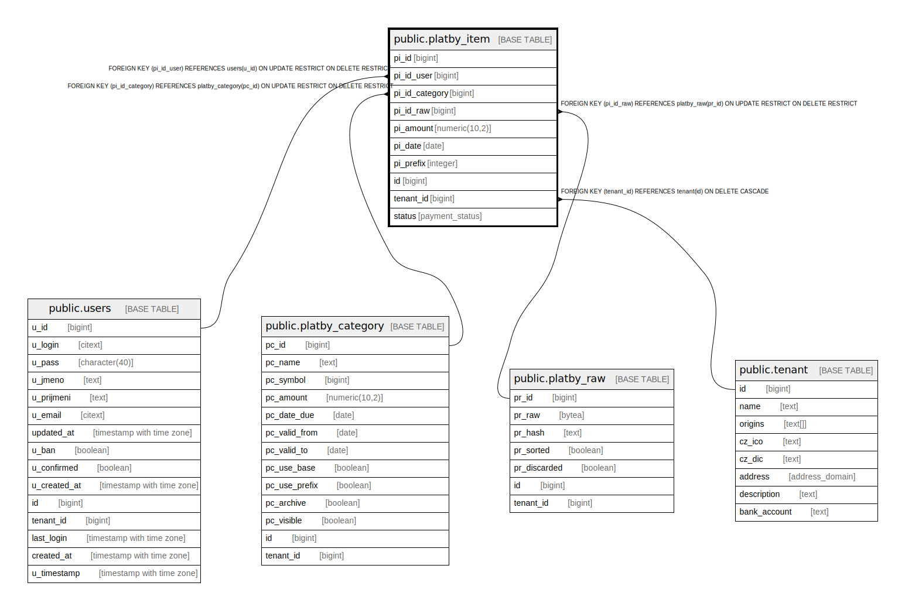

# public.platby_item

## Description

@omit create,update,delete

## Columns

| Name | Type | Default | Nullable | Extra Definition | Children | Parents | Comment |
| ---- | ---- | ------- | -------- | ---------------- | -------- | ------- | ------- |
| pi_id | bigint | nextval('platby_item_pi_id_seq'::regclass) | false |  |  |  |  |
| pi_id_user | bigint |  | true |  |  | [public.users](public.users.md) |  |
| pi_id_category | bigint |  | false |  |  | [public.platby_category](public.platby_category.md) |  |
| pi_id_raw | bigint |  | true |  |  | [public.platby_raw](public.platby_raw.md) |  |
| pi_amount | numeric(10,2) |  | false |  |  |  |  |
| pi_date | date |  | false |  |  |  |  |
| pi_prefix | integer | 2000 | false |  |  |  |  |
| id | bigint |  | false | GENERATED ALWAYS AS pi_id STORED |  |  |  |
| tenant_id | bigint | current_tenant_id() | false |  |  | [public.tenant](public.tenant.md) |  |
| status | payment_status | 'paid'::payment_status | false |  |  |  |  |

## Constraints

| Name | Type | Definition |
| ---- | ---- | ---------- |
| platby_item_pi_id_category_fkey | FOREIGN KEY | FOREIGN KEY (pi_id_category) REFERENCES platby_category(pc_id) ON UPDATE RESTRICT ON DELETE RESTRICT |
| idx_24713_primary | PRIMARY KEY | PRIMARY KEY (pi_id) |
| platby_item_pi_id_raw_fkey | FOREIGN KEY | FOREIGN KEY (pi_id_raw) REFERENCES platby_raw(pr_id) ON UPDATE RESTRICT ON DELETE RESTRICT |
| platby_item_pi_id_user_fkey | FOREIGN KEY | FOREIGN KEY (pi_id_user) REFERENCES users(u_id) ON UPDATE RESTRICT ON DELETE RESTRICT |
| platby_item_unique_id | UNIQUE | UNIQUE (id) |
| platby_item_tenant_id_fkey | FOREIGN KEY | FOREIGN KEY (tenant_id) REFERENCES tenant(id) ON DELETE CASCADE |

## Indexes

| Name | Definition |
| ---- | ---------- |
| idx_24713_primary | CREATE UNIQUE INDEX idx_24713_primary ON public.platby_item USING btree (pi_id) |
| platby_item_unique_id | CREATE UNIQUE INDEX platby_item_unique_id ON public.platby_item USING btree (id) |
| idx_24713_pi_id_raw | CREATE UNIQUE INDEX idx_24713_pi_id_raw ON public.platby_item USING btree (pi_id_raw) |
| idx_24713_platby_item_pi_id_user_fkey | CREATE INDEX idx_24713_platby_item_pi_id_user_fkey ON public.platby_item USING btree (pi_id_user) |

## Relations

---

> Generated by [tbls](https://github.com/k1LoW/tbls)
