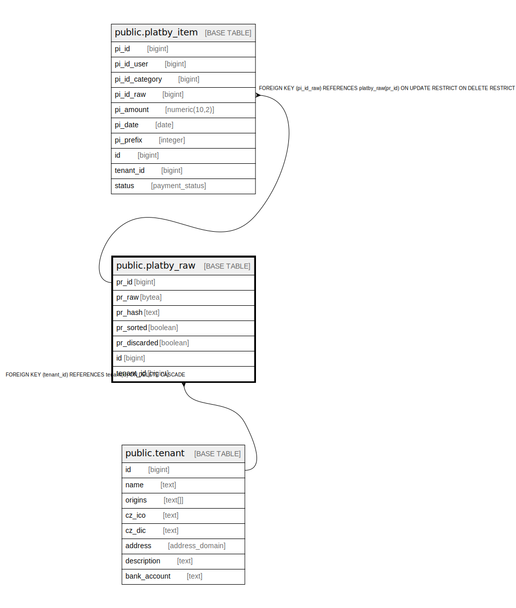

# public.platby_raw

## Description

@omit

## Columns

| Name | Type | Default | Nullable | Extra Definition | Children | Parents | Comment |
| ---- | ---- | ------- | -------- | ---------------- | -------- | ------- | ------- |
| pr_id | bigint | nextval('platby_raw_pr_id_seq'::regclass) | false |  | [public.platby_item](public.platby_item.md) |  |  |
| pr_raw | bytea |  | false |  |  |  |  |
| pr_hash | text |  | false |  |  |  |  |
| pr_sorted | boolean | true | false |  |  |  |  |
| pr_discarded | boolean | true | false |  |  |  |  |
| id | bigint |  | false | GENERATED ALWAYS AS pr_id STORED |  |  |  |
| tenant_id | bigint | current_tenant_id() | false |  |  | [public.tenant](public.tenant.md) |  |

## Constraints

| Name | Type | Definition |
| ---- | ---- | ---------- |
| idx_24720_primary | PRIMARY KEY | PRIMARY KEY (pr_id) |
| platby_raw_unique_id | UNIQUE | UNIQUE (id) |
| platby_raw_tenant_id_fkey | FOREIGN KEY | FOREIGN KEY (tenant_id) REFERENCES tenant(id) ON DELETE CASCADE |

## Indexes

| Name | Definition |
| ---- | ---------- |
| idx_24720_primary | CREATE UNIQUE INDEX idx_24720_primary ON public.platby_raw USING btree (pr_id) |
| platby_raw_unique_id | CREATE UNIQUE INDEX platby_raw_unique_id ON public.platby_raw USING btree (id) |
| idx_24720_pr_hash | CREATE UNIQUE INDEX idx_24720_pr_hash ON public.platby_raw USING btree (pr_hash) |

## Relations

---

> Generated by [tbls](https://github.com/k1LoW/tbls)
