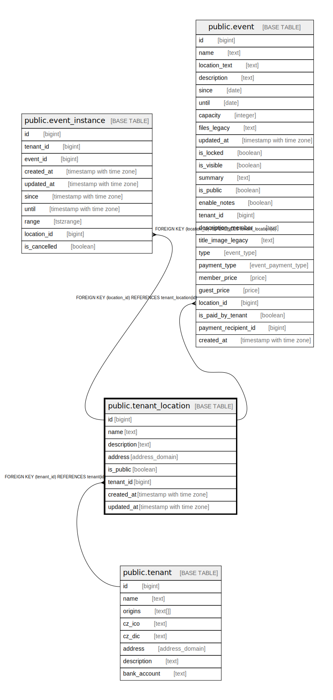

# public.tenant_location

## Description

@simpleCollections only

## Columns

| Name | Type | Default | Nullable | Children | Parents | Comment |
| ---- | ---- | ------- | -------- | -------- | ------- | ------- |
| id | bigint |  | false | [public.event_instance](public.event_instance.md) [public.event](public.event.md) |  |  |
| name | text |  | false |  |  |  |
| description | text | ''::text | false |  |  |  |
| address | address_domain |  | true |  |  |  |
| is_public | boolean | true | true |  |  |  |
| tenant_id | bigint |  | false |  | [public.tenant](public.tenant.md) |  |
| created_at | timestamp with time zone | now() | false |  |  |  |
| updated_at | timestamp with time zone | now() | false |  |  |  |

## Constraints

| Name | Type | Definition |
| ---- | ---- | ---------- |
| tenant_location_pkey | PRIMARY KEY | PRIMARY KEY (id) |
| tenant_location_tenant_id_fkey | FOREIGN KEY | FOREIGN KEY (tenant_id) REFERENCES tenant(id) |

## Indexes

| Name | Definition |
| ---- | ---------- |
| tenant_location_pkey | CREATE UNIQUE INDEX tenant_location_pkey ON public.tenant_location USING btree (id) |

## Relations

---

> Generated by [tbls](https://github.com/k1LoW/tbls)
